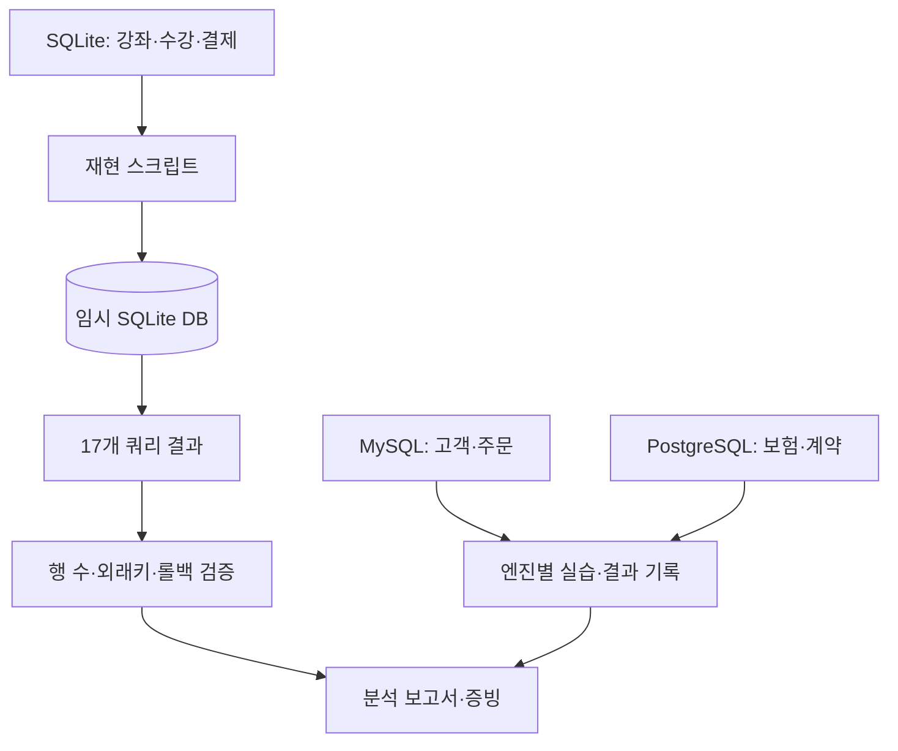

# 관계형 데이터 모델과 SQL 실습

## 프로젝트 소개

SQLite의 커뮤니티 강좌, MySQL의 카페 주문, PostgreSQL의 보험 포트폴리오를 각각 모델링한 SQL 실습 저장소입니다. DB별 스키마·샘플·조회 쿼리와 기존 실행 증빙을 함께 관리합니다.

## 핵심 특징

- 기본키·외래키·고유성 제약을 통한 데이터 무결성
- JOIN·서브쿼리·집계·검색·인덱스 실습
- 변경 쿼리의 트랜잭션과 롤백 예제
- DB 엔진별 도메인·문법·결과 분리
- Python 표준 라이브러리만으로 SQLite 재현

## 아키텍처

`스키마 → 샘플 입력 → 쿼리 실행 → 결과 확인 → 분석 보고서` 순서로 재현합니다. 세 엔진의 SQL은 같은 스키마의 포팅 버전이 아니라 서로 다른 도메인입니다.

| 경로 | 도메인·역할 |
| --- | --- |
| `sql/sqlite/` | 강사·수강생·강좌·신청·결제·출석 |
| `sql/mysql/` | 고객·메뉴·주문·주문 항목 |
| `sql/postgres/` | 보험 상품·고객·계약·보험료·보험금 |
| `evidence/` | 분석 보고서에 연결된 외래키·통합 결과 |
| `tests/fixtures/` | SQLite 검증에 쓰는 테이블별 기준 행 수 |
| `docs/reports/` | 엔진별 JOIN·외래키·지표 분석 |
| `scripts/reproduce.py` | 새 SQLite DB 생성과 쿼리 결과 수집 |



## 실행 환경과 SQLite 재현

Python 3.10 이상과 uv를 사용합니다. 별도 SQLite CLI나 Python 패키지는 필요하지 않습니다. 저장소 루트에서 실행합니다.

```bash
uv sync --frozen
uv run --frozen python scripts/reproduce.py
```

새 DB는 `.runtime/workshop.db`, 쿼리 결과는 `.runtime/results/`에 생성됩니다. 기존 파일이 있으면 덮어쓰지 않고 종료합니다. 다시 실행할 때는 새 경로를 지정합니다.

```bash
uv run --frozen python scripts/reproduce.py --output .runtime/second.db --results .runtime/second-results
```

스키마의 외래키 검사와 17개 쿼리를 실행합니다. 예시의 UPDATE·DELETE는 롤백되며 참조 결과와 검증 기준 파일은 수정하지 않습니다. DB와 개별 쿼리 결과는 필요할 때 재생성합니다.

## 다른 DB 엔진

MySQL과 PostgreSQL은 각각 서버와 CLI가 필요합니다. 스키마에는 기존 테이블 삭제문이 있으므로 전용 실습 DB에서 실행합니다. 준비 명령과 증빙 범위는 [재현 안내](docs/reproduction.md)를 참고합니다.

## 검증

```bash
make check
make test
make smoke
```

임시 디렉토리에서 SQLite 생성·쿼리 실행·테이블 행 수·외래키 위반 차단·변경 롤백을 확인합니다. MySQL·PostgreSQL 검증 결과와 SQLite 검증 결과를 구분합니다.

`make check`는 정적 분석·포맷·문서 검사를, `make test`는 `uv run --frozen pytest -q`로 전체 동작 검사를 실행합니다. `make smoke`는 같은 테스트 중 `smoke` 마커가 붙은 실행 확인만 선택합니다(`uv run --frozen pytest -q -m smoke`). 테스트는 `test_*.py`와 fixture로 구성하며 임시 DB·파일과 모의 요청을 사용합니다.

## 분석 보고서

- [SQLite 분석](docs/reports/sqlite.md)
- [MySQL 분석](docs/reports/mysql.md)
- [PostgreSQL 분석](docs/reports/postgres.md)
